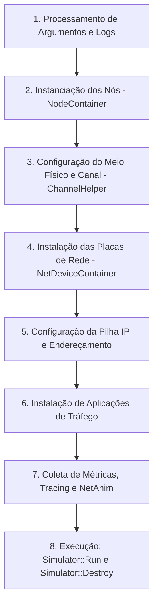

# 📘 Explicação Detalhada dos Exemplos Nativos (Tutorial NS-3 e VLC)

Este documento reúne a explicação aprofundada, conceitual e prática de todos os exemplos nativos disponíveis nesta pasta (`exemplos_tutorial_vlc/`), contemplando os 8 tutoriais canônicos do **NS-3.25** e o exemplo do módulo de **Comunicação por Luz Visível (VLC / Li-Fi)**.

---

## 📑 Sumário

1. [Ciclo de Vida de um Script no NS-3 (Padrão Arquitetural)](#1-ciclo-de-vida-de-um-script-no-ns-3-padrão-arquitetural)
2. [Tabela Rápida de Execução](#2-tabela-rápida-de-execução)
3. [Exemplo 0: `hello-simulator.cc` — Sistema Unificado de Logs](#3-exemplo-0-hello-simulatorcc--sistema-unificado-de-logs)
4. [Exemplo 1: `first.cc` — Topologia Ponto a Ponto e Cálculo Analítico de Latência](#4-exemplo-1-firstcc--topologia-ponto-a-ponto-e-cálculo-analítico-de-latência)
5. [Exemplo 2: `second.cc` — Redes Híbridas (P2P + Barramento CSMA) e Roteamento Global](#5-exemplo-2-secondcc--redes-híbridas-p2p--barramento-csma-e-roteamento-global)
6. [Exemplo 3: `third.cc` — Redes Sem Fio Wi-Fi 802.11 e Modelos de Mobilidade](#6-exemplo-3-thirdcc--redes-sem-fio-wi-fi-80211-e-modelos-de-mobilidade)
7. [Exemplo 4: `fourth.cc` — Rastreamento Interno com TracedValue e Callbacks](#7-exemplo-4-fourthcc--rastreamento-interno-com-tracedvalue-e-callbacks)
8. [Exemplo 5: `fifth.cc` — Pilha TCP, Sockets C++, Janela de Congestionamento e Erros](#8-exemplo-5-fifthcc--pilha-tcp-sockets-c-janela-de-congestionamento-e-erros)
9. [Exemplo 6: `sixth.cc` — Exportação de Traces ASCII e Captura Condicional PCAP](#9-exemplo-6-sixthcc--exportação-de-traces-ascii-e-captura-condicional-pcap)
10. [Exemplo 7: `seventh.cc` — Framework de Estatística, Gnuplot e Transição para IPv6](#10-exemplo-7-seventhcc--framework-de-estatística-gnuplot-e-transição-para-ipv6)
11. [Exemplo 8: `vlc_example.cc` — Comunicação Óptica Sem Fio (Li-Fi / VLC)](#11-exemplo-8-vlc_examplecc--comunicação-óptica-sem-fio-li-fi--vlc)

---

## 1. Ciclo de Vida de um Script no NS-3 (Padrão Arquitetural)

Todos os scripts em C++ do NS-3 seguem uma sequência estruturada e determinística de 8 passos:



### Abstrações e Helpers
Para evitar que o desenvolvedor precise instanciar centenas de objetos manualmente, o NS-3 utiliza **Containers** (ponteiros de objetos agrupados) e **Helpers** (classes utilitárias de instalação com padrões sensatos):
- `NodeContainer`: Agrupa os nós computacionais.
- `NetDeviceContainer`: Agrupa placas de interface de rede (NICs).
- `Ipv4InterfaceContainer`: Mapeia nós, placas e seus endereços IP.
- `ApplicationContainer`: Controla a inicialização e encerramento de aplicações (`Start`, `Stop`).

---

## 2. Tabela Rápida de Execução

Todos os exemplos podem ser disparados da raiz do projeto via `make run <nome>`:

| Arquivo | Conceito Central | Comando de Execução |
| :--- | :--- | :--- |
| [`hello-simulator.cc`](file:///home/laisa/ns3-25/exemplos_tutorial_vlc/hello-simulator.cc) | Sistema de logs unificado | `make run hello-simulator` |
| [`first.cc`](file:///home/laisa/ns3-25/exemplos_tutorial_vlc/first.cc) | Enlace P2P, UDP Echo, cálculo de latência | `make run first` |
| [`second.cc`](file:///home/laisa/ns3-25/exemplos_tutorial_vlc/second.cc) | Rede híbrida P2P + CSMA LAN, roteador, PCAP | `make run second` |
| [`third.cc`](file:///home/laisa/ns3-25/exemplos_tutorial_vlc/third.cc) | Wi-Fi 802.11a, mobilidade aleatória 2D | `make run third ARGS="--nWifi=5"` |
| [`fourth.cc`](file:///home/laisa/ns3-25/exemplos_tutorial_vlc/fourth.cc) | Callbacks e rastreamento via TracedValue | `make run fourth` |
| [`fifth.cc`](file:///home/laisa/ns3-25/exemplos_tutorial_vlc/fifth.cc) | TCP Sockets, dinâmica de cwnd, injeção de erro | `make run fifth` |
| [`sixth.cc`](file:///home/laisa/ns3-25/exemplos_tutorial_vlc/sixth.cc) | Traces ASCII em disco, captura condicional PCAP | `make run sixth` |
| [`seventh.cc`](file:///home/laisa/ns3-25/exemplos_tutorial_vlc/seventh.cc) | Framework estatístico, gráficos Gnuplot, IPv6 | `make run seventh ARGS="--useIpv6=1"` |
| [`vlc_example.cc`](file:///home/laisa/ns3-25/exemplos_tutorial_vlc/vlc_example.cc) | Comunicação óptica Li-Fi, modulações, NetAnim | `make run vlc_example` |

---

## 3. Exemplo 0: `hello-simulator.cc` — Sistema Unificado de Logs

### O que o código faz
É o script introdutório do simulador. Ele valida o ambiente de compilação e demonstra como o sistema de **Logging** do NS-3 substitui diretivas tradicionais como `printf` ou `std::cout`.

```cpp
#include "ns3/core-module.h"

using namespace ns3;

NS_LOG_COMPONENT_DEFINE ("HelloSimulator");

int main (int argc, char *argv[])
{
  NS_LOG_UNCOND ("Hello Simulator");
}
```

### Pontos-chave de funcionamento
1. **Componente de Log (`NS_LOG_COMPONENT_DEFINE`)**: Associa todas as mensagens do arquivo a um identificador nomeado (`HelloSimulator`).
2. **Níveis de severidade do NS-3**:
   - `NS_LOG_ERROR`: Falhas críticas.
   - `NS_LOG_WARN`: Comportamentos inesperados não fatais.
   - `NS_LOG_INFO`: Informações de eventos importantes (ex: pacote enviado).
   - `NS_LOG_FUNCTION`: Rastreamento de chamadas de funções e argumentos.
   - `NS_LOG_LOGIC`: Detalhes das decisões internas de algoritmos de protocolos.
3. **Controle dinâmico via variável de ambiente**: É possível ativar logs de qualquer módulo sem recompilar o C++:
   ```bash
   export NS_LOG="UdpEchoClientApplication=level_info:UdpEchoServerApplication=level_info"
   ```

---

## 4. Exemplo 1: `first.cc` — Topologia Ponto a Ponto e Cálculo Analítico de Latência

### Topologia
Dois nós conectados diretamente por um canal de comunicação serial cabeado Ponto a Ponto (Point-to-Point):

```text
    10.1.1.1                                         10.1.1.2
  +------------+                                   +------------+
  |    Nó 0    | ───────────────────────────────── |    Nó 1    |
  |  (Cliente) |           Enlace P2P              | (Servidor) |
  +------------+          5 Mbps, 2 ms             +------------+
```

### Funcionamento do código
1. **Nós**: `NodeContainer nodes; nodes.Create (2);` cria o Nó 0 e o Nó 1.
2. **Canal e Interface**: `PointToPointHelper` define taxa de transmissão de `5 Mbps` e atraso de propagação de `2 ms`. O método `pointToPoint.Install (nodes)` cria um `PointToPointNetDevice` em cada nó e os liga pelo `PointToPointChannel`.
3. **Pilha TCP/IP**: `InternetStackHelper stack; stack.Install (nodes);` instala as camadas de rede e transporte (IPv4, ARP, UDP, TCP).
4. **Endereçamento**: `Ipv4AddressHelper address; address.SetBase ("10.1.1.0", "255.255.255.0");` associa os IPs `10.1.1.1` (Nó 0) e `10.1.1.2` (Nó 1).
5. **Aplicações**:
   - `UdpEchoServerHelper` na porta `9` no Nó 1, ativo de $t = 1\text{ s}$ até $t = 10\text{ s}$.
   - `UdpEchoClientHelper` no Nó 0 configurado para enviar 1 pacote de $1024\text{ bytes}$ às $t = 2\text{ s}$.

### Cálculo Matemático dos Tempos de Chegada
Ao rodar `make run first`, o console exibe:
```text
At time 2s client sent 1024 bytes to 10.1.1.2 port 9
At time 2.00369s server received 1024 bytes from 10.1.1.1 port 49153
At time 2.00369s server sent 1024 bytes to 10.1.1.1 port 49153
At time 2.00737s client received 1024 bytes from 10.1.1.2 port 9
```

**Por que exatamente $2{,}00369\text{ s}$ e retorno em $2{,}00737\text{ s}$?**
- **Tamanho total do frame na camada física**:  
  Payload UDP ($1024\text{ B}$) + Cabeçalho UDP ($8\text{ B}$) + Cabeçalho IPv4 ($20\text{ B}$) + Cabeçalho PointToPoint ($2\text{ B}$) = $1054\text{ bytes} = 8432\text{ bits}$.
- **Tempo de Transmissão ($T_{tx}$)** em $5\text{ Mbps}$ ($5 \times 10^6\text{ bps}$):  
  $$T_{tx} = \frac{8432\text{ bits}}{5.000.000\text{ bps}} = 0{,}0016864\text{ s} \approx 1{,}69\text{ ms}$$
- **Atraso de Propagação no Canal ($T_{prop}$)**: Configurado em $2\text{ ms} = 0{,}002\text{ s}$.
- **Instante de Chegada no Servidor**:  
  $$t_{rx} = t_{tx} + T_{tx} + T_{prop} = 2{,}0 + 0{,}0016864 + 0{,}002 = 2{,}0036864\text{ s} \approx 2{,}00369\text{ s}$$
- **Instante de Retorno do Eco**:  
  O servidor retransmite o pacote em resposta imediata, incorrendo em mais $3{,}6864\text{ ms}$:  
  $$t_{retorno} = 2{,}0036864 + 0{,}0036864 = 2{,}0073728\text{ s} \approx 2{,}00737\text{ s}$$

---

## 5. Exemplo 2: `second.cc` — Redes Híbridas (P2P + Barramento CSMA) e Roteamento Global

### Topologia
O `second.cc` demonstra a interconexão de duas sub-redes diferentes através de um nó roteador intermediário:

```text
      Sub-rede P2P 10.1.1.0/24                   Sub-rede CSMA/LAN 10.1.2.0/24
      
  [ Nó 0 ] ────────────── [ Nó 1 ] ═════════ [ Nó 2 ] ═════════ [ Nó 3 ] ═════════ [ Nó 4 ]
  (Cliente)      P2P     (Roteador)                     Barramento Compartilhado   (Servidor)
            5 Mbps, 2ms                                     100 Mbps, 6560 ns
```

### Funcionamento do código
1. **Nós e Sub-redes**:
   - Cria nós P2P e nós CSMA. O Nó 1 pertence simultaneamente aos dois grupos (`p2pNodes.Get (1)` é o mesmo que `csmaNodes.Get (0)`).
2. **Canal CSMA (Carrier Sense Multiple Access)**:
   - Modela uma LAN Ethernet em barramento compartilhado com taxa de $100\text{ Mbps}$ e atraso de propagação de $6560\text{ ns}$.
   - Todos os nós no canal CSMA disputam o mesmo meio físico e escutam portadora antes de transmitir.
3. **Roteamento Global (`Ipv4GlobalRoutingHelper`)**:
   ```cpp
   Ipv4GlobalRoutingHelper::PopulateRoutingTables ();
   ```
   Como o Nó 0 quer enviar um pacote para o Nó 4 (em outra sub-rede), o Nó 1 precisa atuar como roteador (gateway). O helper executa o algoritmo de Dijkstra na topologia completa e preenche as tabelas de rotas de todos os nós automaticamente.
4. **Captura de Pacotes PCAP**:
   ```cpp
   pointToPoint.EnablePcapAll ("second");
   csma.EnablePcap ("second", csmaDevices.Get (1), true);
   ```
   Gera arquivos `.pcap` compatíveis com Wireshark e tcpdump, habilitando o modo promíscuo no nó CSMA monitorado.

---

## 6. Exemplo 3: `third.cc` — Redes Sem Fio Wi-Fi 802.11 e Modelos de Mobilidade

### Topologia
Combina três tecnologias de enlace: nós móveis em Wi-Fi sem fio, enlace cabeado P2P e rede local CSMA:

```text
   Sub-rede Wi-Fi (10.1.3.0)            Sub-rede P2P (10.1.1.0)       Sub-rede CSMA (10.1.2.0)
   
  [ Nó 5 ] (Móvel)  \
  [ Nó 6 ] (Móvel) ─── [ Nó 0 (AP) ] ────────────── [ Nó 1 ] ══════ [ Nó 2 ] ══════ [ Nó 3 ]
  [ Nó 7 ] (Móvel)  /     Wi-Fi             P2P                         Barramento CSMA
```

### Funcionamento do código
1. **Pilha Wi-Fi 802.11a**:
   - `YansWifiChannelHelper` e `YansWifiPhyHelper`: Configuram canal de rádio com perda no espaço livre (`FriisPropagationLossModel`) e ruído térmico.
   - `WifiMacHelper`: Configura o padrão IEEE 802.11a e o identificador de rede (SSID `"ns-3-ssid"`).
   - O Nó 0 opera como Ponto de Acesso (`ApWifiMac`), enquanto os nós clientes operam como estações infraestruturadas (`StaWifiMac`).
2. **Modelos de Mobilidade (`MobilityHelper`)**:
   - **Nó AP e nós CSMA (Fixos)**: Utilizam `ConstantPositionMobilityModel` para fixar suas posições cartesianas estáticas.
   - **Nós Wi-Fi Clientes (Móveis)**:
     - Posição inicial alocada em grade via `GridPositionAllocator`.
     - Movimentação dinâmica governada por `RandomWalk2dMobilityModel`: os nós caminham em direções aleatórias dentro de um retângulo delimitado com velocidade configurável.
3. **Parâmetros Dinâmicos via Linha de Comando**:
   ```bash
   make run third ARGS="--nWifi=10 --tracing=true"
   ```
   Permite alterar a quantidade de nós móveis sem alterar o código-fonte C++.

---

## 7. Exemplo 4: `fourth.cc` — Rastreamento Interno com TracedValue e Callbacks

### O que o código faz
Demonstra a arquitetura de **desacoplamento** entre a lógica dos protocolos de rede e o sistema de monitoramento/telemetria no NS-3.

### Funcionamento do código
Tradicionalmente, desenvolvedores inserem prints dentro dos códigos de protocolo, o que polui a implementação. O NS-3 soluciona isso usando o padrão Observer com `TracedValue` e `Callbacks`:

```cpp
// 1. Variável monitorada encapsulada pelo protocolo:
TracedValue<int32_t> m_myInt;

// 2. Função de callback definida pelo usuário no script de simulação:
void IntTrace (int32_t oldValue, int32_t newValue)
{
  std::cout << "Traced " << oldValue << " to " << newValue << std::endl;
}

// 3. Conexão transparente sem alterar o código-fonte do protocolo:
myObject->TraceConnectWithoutContext ("MyInteger", MakeCallback (&IntTrace));
```

Toda alteração de valor na variável interna dispara a execução da função de callback fornecida pelo usuário, passando o valor antigo e o novo valor.

---

## 8. Exemplo 5: `fifth.cc` — Pilha TCP, Sockets C++, Janela de Congestionamento e Erros

### O que o código faz
Estuda o comportamento do protocolo de transporte orientado a conexão **TCP** sob perdas de pacotes na camada física.

```text
    Nó 0 (Transmissor TCP) ──────────────────────── Nó 1 (Receptor / PacketSink)
           (MyApp)                5 Mbps, 2 ms                (RateErrorModel: 0.00001)
```

### Funcionamento do código
1. **Aplicação Customizada C++ (`MyApp`)**:
   - Herda diretamente de `ns3::Application`.
   - Implementa chamadas nativas à API de Sockets do NS-3: `Socket::Bind()`, `Socket::Connect()` e `Socket::Send()`.
   - Agenda transmissões periódicas usando `Simulator::Schedule ()`.
2. **Receptor (`PacketSinkHelper`)**:
   - Abre um socket TCP receptor na porta `8080` para drenar os pacotes recebidos.
3. **Dinâmica da Janela de Congestionamento (`CongestionWindow` / `cwnd`)**:
   - O script monitora o tamanho da variável `CongestionWindow` do socket TCP via callback.
   - Observa o crescimento exponencial durante a fase de *Slow Start*.
4. **Injeção Física de Falhas (`RateErrorModel`)**:
   - Instala um modelo estocástico de erro com taxa de erro de bits ($10^{-5}$).
   - Quando um segmento é corrompido, o receptor não envia ACK, provocando timeout ou triplo ACK duplicado no transmissor.
   - O callback registra a queda brusca imediata da `cwnd`, ilustrando a prevenção de colapso de congestionamento do TCP.

---

## 9. Exemplo 6: `sixth.cc` — Exportação de Traces ASCII e Captura Condicional PCAP

### O que o código faz
Ensina técnicas avançadas de instrumentação para persistência de dados no disco e inspeção granular de falhas de rede.

### Funcionamento do código
1. **Arquivo ASCII Estruturado (`AsciiTraceHelper`)**:
   - Conecta-se à fonte de rastreamento `CongestionWindow` e grava um arquivo colunar (`sixth.cwnd`) contendo pares `(tempo_segundos, tamanho_cwnd)`.
   - Esses dados podem ser lidos diretamente por ferramentas de plotagem científica (Gnuplot, Python Pandas, MATLAB).
2. **Captura Condicional de Pacotes Descartados**:
   - Em simulações de longa duração com milhões de pacotes, arquivos PCAP completos tornam-se gigantescos.
   - O `sixth.cc` conecta um gravador PCAP especificamente no trace source `PhyRxDrop`.
   - Somente pacotes descartados pela camada física por erros de bits são salvos no arquivo `.pcap`, facilitando a análise forense no Wireshark.

---

## 10. Exemplo 7: `seventh.cc` — Framework de Estatística, Gnuplot e Transição para IPv6

### O que o código faz
Apresenta o framework unificado de estatística do NS-3, automação de gráficos científicos e o suporte nativo a redes de próxima geração com IPv6.

### Funcionamento do código
1. **Framework `stats`**:
   - Utiliza coletores (`DataCollector`), agregadores e filtros matemáticos para computar médias, desvios e contagens de tráfego de forma padronizada.
2. **Automação com `GnuplotHelper`**:
   - Cria arquivos de controle de plotagem (`.plt`) automaticamente com títulos de eixos, legendas e séries temporais já configuradas.
   - Gera gráficos prontos com o comando `gnuplot arquivo.plt`.
3. **Transição Transparente para IPv6**:
   - O script possui o parâmetro booleano `--useIpv6`.
   - Quando ativado (`make run seventh ARGS="--useIpv6=1"`), substitui a pilha IPv4 e endereços `10.1.1.x` pela pilha IPv6 com prefixos globais `2001:0000:f00d:cafe::/64`, demonstrando a interoperabilidade da arquitetura do NS-3.

---

## 11. Exemplo 8: `vlc_example.cc` — Comunicação Óptica Sem Fio (Li-Fi / VLC)

### O que o código faz
Modela uma rede óptica sem fio indoor utilizando luz visível emitida por diodos emissores de luz (LEDs) e detectada por fotodiodos (PD).

```text
                 [ LED TX ] (Teto / Luminária)
                     │ \
                     │  \  Feixe de Luz Visível (Canal Lambertiano)
                     │   \
                     ▼    ▼
              [ Fotodetector RX ] (Dispositivo Móvel / Mesa)
```

### Funcionamento do código
1. **Topologia e Geometria Tridimensional**:
   - Os nós emissores e receptores são posicionados com coordenadas cartesianas 3D $(x, y, z)$.
   - O transmissor é posicionado em um plano superior (ex: teto a $z = 3{,}0\text{ m}$), simulando uma luminária LED comercial.
2. **Modelagem Física do Canal Óptico (`VlcChannelModel`)**:
   - **Padrão de Emissão Lambertiano**: A intensidade da luz emitida diminui em função do cosseno do ângulo de emissão $\phi$ elevado à ordem de emissão $m$.
   - **Receptor Óptico**: Modela a área ativa do fotodiodo ($A$), ganho do concentrador óptico ($g(\psi)$) e o ângulo limite do Campo de Visão (*Field of View* - FOV $\Psi_c$). Sinais fora do FOV sofrem atenuação total.
3. **Modulações Ópticas Suportadas**:
   - **OOK (On-Off Keying)**: A presença de pulso de luz representa o bit 1 e a ausência representa o bit 0.
   - **VPPM (Variable Pulse Position Modulation)**: Padrão IEEE 802.15.7 que varia a largura do pulso para permitir controle conjunto de iluminação ambiente (dimerização) e transmissão contínua de dados.
   - **PAM-4, PSK-4 e QAM-16**: Modulações de ordem superior para taxas de transmissão elevadas em enlaces de curta distância.
4. **Transporte de Dados e Visualização Gráfica**:
   - Transmissão de tráfego TCP em alta velocidade sobre o enlace óptico.
   - Instanciação de `AnimationInterface` gerando o arquivo XML para visualização gráfica da rede no NetAnim:
     ```bash
     make run vlc_example
     make netanim
     ```
